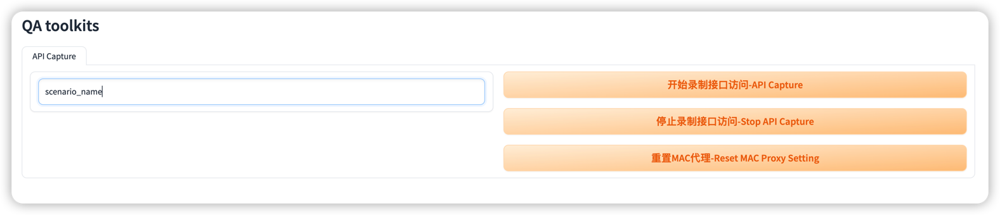

# 极简接口录制工具

一天时间完成了一个极简接口录制工具，主要功能包括了:
1. 录制API请求到数据库，可以是sqlite/postgresql
2. 手工录制API的时候会手工设置浏览器代理，使用命令行或者UI的方式一键完成

录制的API请求主要作用是为了方便生成API测试代码,测试和开发都可以使用. 选择需要的API保存到数据库, 方便后续继续使用. 

这个工具的好处就是: 成本很低. 就一天时间实现最需要的功能.

## 命令行工具 Commandline Features

- 启动mitmproxy和自制插件录制api 请求

```shell
poetry run qacli capture start --name="scenario_name"
```


- 录制什么网站的请求可以在: configs/settings.toml 中配置

```shell
mitm = { recorded_url = "https://www.baidu.com,https://www.bing.com" }
```

上面的例子表示所有baidu和bing地址的请求都会被抓取保存到数据库.

- 数据库表结构:

```python
class ApiMonitorRecord(SQLModel, table=True):
    __tablename__ = "api_monitor_record"

    id: Optional[int] = Field(default=None, primary_key=True)
    app: Optional[str] = None
    service: Optional[str] = None
    api: Optional[str] = None
    path: Optional[str] = None
    request_url: Optional[str] = None
    method: Optional[str] = None
    request_headers: Optional[str] = None
    request_body: Optional[str] = None
    response_headers: Optional[str] = None
    status_code: int
    response_body: Optional[str] = None
    scenario_name: Optional[str] = None

```

- turn on/off proxy for MAC： 

```shell
 poetry run qacli mac-proxy --help
                                                                                                                                                         
 Usage: qacli mac-proxy [OPTIONS] COMMAND [ARGS]...                                                                                                      
                                                                                                                                                         
╭─ Options ─────────────────────────────────────────────────────────────────────────────────────────────────────────────────────────────────────────────╮
│ --help          Show this message and exit.                                                                                                           │
╰───────────────────────────────────────────────────────────────────────────────────────────────────────────────────────────────────────────────────────╯
╭─ Commands ────────────────────────────────────────────────────────────────────────────────────────────────────────────────────────────────────────────╮
│ off                  disable api capture proxy                                                                                                        │
│ on                   enable api capture proxy 
```

## UI界面功能 UI Feature

运行UI: 

```shell
poetry run qaui
```


UI功能操作: 

- 输入录取的场景名称: 任何名字都可以
- 操作相关页面，API接口都会被录制
- 查询数据库，所有这个场景名称的API请求都会被记录
```sql
select * from api_monitor_record where scenario_name=<your_record_name>
```
- 可以对保存的数据进行批量转换成你需要的自动化测试或者数据准备工具

## 使用到python相关

主要包括了:
1. typer: 命令行构建工具
2. gradio: ui构建工具
3. 数据库操作：原先自己就有的基于sqlmodel的访问工具
4. poetry: python项目管理，打包/依赖管理


## To Do

- [] 后台管理录制数据
- [] 接口数据下载
- [] 下载数据修改后直接用于自动化测试
- [] postman 接口数据管理
- [] Code Generation
- [] ......

## References

- [gradio]
- [todo-cli-app]( https://github.com/tddschn/todo-cli-tddschn.git)
